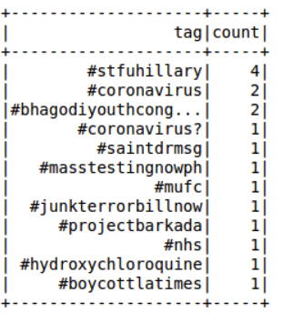
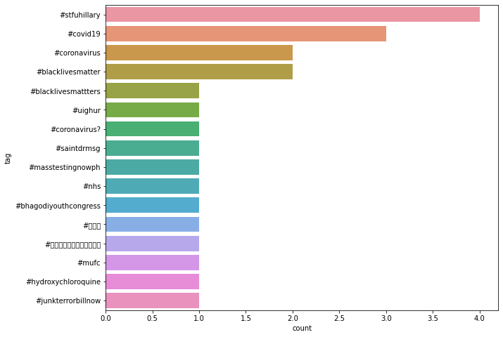

# pyspark-streaming-twitter
This is to use Spark Streaming with Twitter to identify hashtags and return top trending hashtags relating to 'pandemic'. See [Spark Streaming Document](http://spark.apache.org/docs/latest/streaming-programming-guide.html).

## Requirement
- setup a Developer API acocunt with Twitter and create an application to get credentials (https://apps.twitter.com/)
- pip3 install tweepy
- pip3 install matplotlib
- pip3 install seaborn
- pip3 install pandas

## Steps
- open virtualbox (ubuntu + spark)
- open terminal 1
- jupyter-notebook (browser opens)
- open terminal 2
- python3 TweetRead.py (Make sure to add your own IP Adress, Port and your Twitter credential keys)
- run steps in jupyter notebook

## Result

